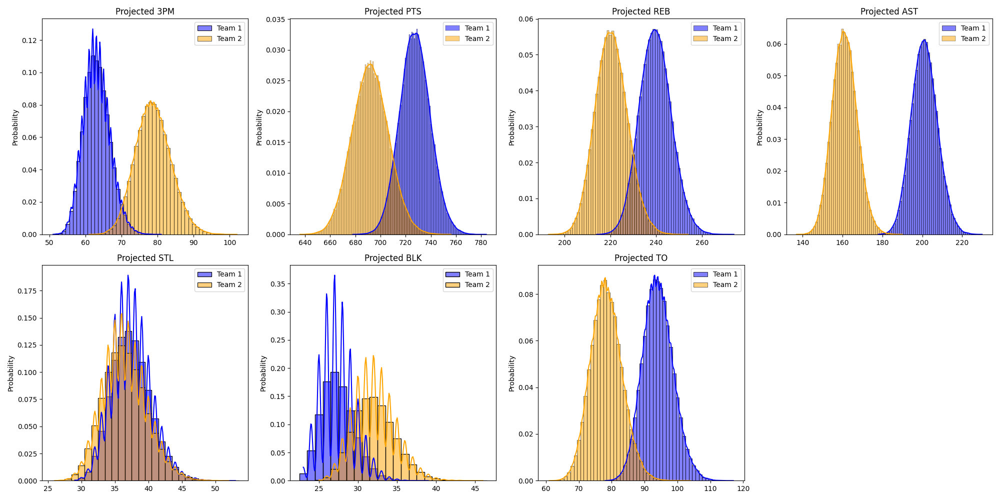

## Why I built this

Weekly fantasy decisions — who to start, who to stream, who to drop — are usually made on vibes. This project replaces the vibes with a reproducible pipeline: pull the live league state from Yahoo, project the next ~7 days of head-to-head category math, and ship a single Excel workbook that tells me exactly where my matchup is fragile and which waiver pickups would actually move those categories.

It runs on demand or on a daily cron, and it's been the backbone of my real fantasy season.

## What it produces

Each run writes one Excel workbook with four sheets:

**Matchup Board.** Head-to-head category projections for me vs. my scheduled opponent across the nine standard Yahoo categories (FG%, FT%, 3PTM, PTS, REB, AST, ST, BLK, TO). Three time slices per category — `Now` (already locked in), `Future` (remaining games × projected per-game), and `Total`. Makes it explicit whether a lead is real or fragile.

**Average Impact.** Season-average impact per player, with a graceful fallback to prior-season averages when the current sample is too small (GP < 10). This avoids the classic "one good game makes a stretch waiver pickup look elite" trap.

**Free Agents.** Ranked waiver-wire candidates filtered by which categories I am *actually* losing in this matchup, scored by `remaining games × per-game impact` on those categories. Not generic rest-of-season rankings — pickups specifically tuned to flip the categories that matter this week.

**Injury Tracking Lists.** A persistent watchlist of injured / suspended / low-availability players, merged from Yahoo statuses, ESPN's injury feed, and free-text player notes. Each row carries a return-rate score, expected return date, the keyword that triggered the pickup ("questionable", "doubtful", "G-League", "minutes restriction"…), a recency bucket, and per-game category impact. The sheet is reloaded from the previous run on every refresh, so dropoffs and upgrades day-over-day are visible.

## Architecture

```
┌─────────────────┐    OAuth 2.0     ┌──────────────────────┐
│  yahoo_auth.py  │ ───────────────▶ │  Yahoo Fantasy API   │
└────────┬────────┘                  └──────────┬───────────┘
         │ tokens                                │ XML/JSON
         ▼                                       ▼
┌─────────────────┐                  ┌──────────────────────┐
│ yahoo_client.py │ ◀──────────────  │   data_fetch.py      │
└─────────────────┘                  │  (rosters, matchups, │
                                     │   stats, schedules)  │
                                     └──────────┬───────────┘
                                                │
                       ┌────────────────────────┼────────────────────────┐
                       ▼                        ▼                        ▼
            ┌─────────────────────┐  ┌─────────────────────┐  ┌─────────────────────┐
            │  projections.py     │  │ external_injuries.py│  │   NBA schedule API  │
            │ (totals / future /  │  │   (ESPN feed)       │  │ (games remaining)   │
            │  free-agent score)  │  └─────────────────────┘  └─────────────────────┘
            └──────────┬──────────┘
                       ▼
            ┌──────────────────────┐
            │   output_writer.py   │  ──▶  output/matchup_report.xlsx
            └──────────────────────┘
```

Module map:

| File | Responsibility |
| --- | --- |
| `src/config.py` | Loads and validates `.env` settings |
| `src/yahoo_auth.py` | OAuth 2.0 flow, token persistence, automatic refresh |
| `src/yahoo_client.py` | Thin Yahoo Fantasy API wrapper with retry + tree-walking helpers |
| `src/data_fetch.py` | League / team / roster / stat fetchers and the schedule heuristic |
| `src/projections.py` | Per-player projections, matchup category math, free-agent scoring |
| `src/external_injuries.py` | ESPN injury feed + normalized name matching |
| `src/output_writer.py` | openpyxl Excel writer with conditional formatting |
| `run_manual.py` | Main entrypoint — full report |
| `run_matchup_board.py` | Matchup-board-only entrypoint (custom week / opponent) |
| `run_week22_playoff_boards.py` | Playoff-week variant for two arbitrary teams |

## Design notes

**Stats are computed, not scraped.** All projections come from the Yahoo Fantasy API. ESPN is used only for injury context.

**Time-aware projections.** Splitting each category into `Now / Future / Total` was the most useful UX choice in the whole project. A 12–11 lead in 3PTM looks different when `Now` is 10–4 vs. when `Now` is 2–9 — and the board makes that obvious without me having to mentally subtract.

**Sample-size guardrails.** Per-game rates fall back to season averages or prior-season averages when fewer than two games exist in the rolling window. Prevents waiver candidates from looking artificially elite off a single hot night.

**Injury intelligence as a first-class feature.** The Injury Tracking sheet isn't just an INJ tag — it scores each watched player on (1) keyword urgency parsed from Yahoo player notes, (2) ESPN's published expected return date, (3) recency of the news, and (4) per-category fantasy impact. Names listed in `MANUAL_TRACK_PLAYERS` are pinned regardless of status.

**Name normalization.** Yahoo, ESPN, and the NBA schedule feed disagree on accents, suffixes, and punctuation. `external_injuries.normalize_name` makes the joins reliable.

**Token hygiene.** Secrets in `.env`, OAuth tokens in `data/yahoo_tokens.json`, both gitignored.

## Quickstart

```bash
git clone <repo-url>
cd codex-nba-fantasy-analytics
pip install -r requirements.txt
cp .env.example .env       # then fill in Yahoo client id/secret + league + team
python run_manual.py       # one-time OAuth on first run
```

Custom-week scouting:

```bash
python run_matchup_board.py --week 23                                    # auto-detect opponent
python run_matchup_board.py --week 24 --my-team-id 1 --opponent-team-id 12
python run_matchup_board.py --week 25 --team-a-id 3 --team-b-id 8        # any two teams
```

Optional daily cron:

```bash
./install_daily_cron.sh         # default 08:00
./install_daily_cron.sh 7 30    # custom 07:30
./remove_daily_cron.sh
```

## Roadmap

- Streamer-of-the-day suggestions based on schedule density
- Punt-build detector (auto-identify which categories the roster is implicitly punting)
- Slack / email summary in addition to the Excel report
- Backtest harness for projection accuracy

## Source

[GitHub repository →](#){.btn .btn-primary}

<!-- TODO: replace href above with the public repo URL once the project is published. -->
