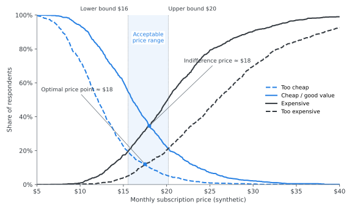
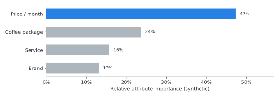
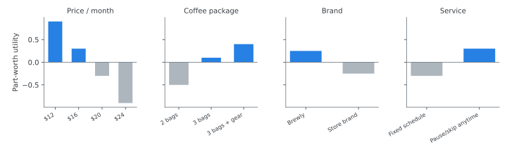

## Experience at a glance

**Senior Research Executive · Ipsos Taiwan · Sep 2019 – Sep 2021**

- Designed **pricing and brand research studies** using Van Westendorp price sensitivity analysis, conjoint analysis, regression, and experimentation to guide pricing, positioning, and investment decisions for enterprise clients
- Combined survey, social-listening, and quantitative analysis. For a global food & beverage account, the insights helped drive **120% YoY growth in the client's investment**
- Supervised a team of three to design research and turn the results into recommendations that client stakeholders adopted

---

## Method demo: pricing a new subscription

[Illustrative demonstration using synthetic data. No client data is shown.]{.illustrative}

To show *how* I approach this kind of problem without reproducing any client work, this demo follows one **fictional product**: *Brewly*, a monthly coffee-bean subscription preparing to launch.

### 1. The research question

> **How should Brewly set an acceptable price range, understand the trade-offs customers will make, and check that its positioning works?**

No single method answers all three parts, so each method is matched to one part:

::: {.card-grid-2}
::: {}
**Van Westendorp price sensitivity** 
*What price range will customers accept?*
:::
::: {}
**Conjoint analysis** 
*What will customers trade off: features, brand, service, or price?*
:::
::: {}
**Regression** 
*What drives purchase intent and brand perception?*
:::
::: {}
**Experiments** 
*Which message or concept performs better?*
:::
:::

### 2. Van Westendorp: finding the acceptable price range

Respondents answer four questions. At what price would the product be *too cheap* to trust, *cheap / a good deal*, *getting expensive*, and *too expensive* to consider? Plotting the four cumulative curves shows where price resistance begins.

{fig-alt="Four cumulative curves (too cheap, cheap, expensive, too expensive) across monthly prices from $5 to $40, with a shaded acceptable price range between the lower and upper bounds."}

[Illustrative demonstration using synthetic data. No client data is shown.]{.illustrative}

**How to read it**

- **Acceptable range (shaded):** between the lower bound, where "too cheap" meets "expensive", and the upper bound, where "cheap" meets "too expensive". Pricing outside this band risks either a quality signal problem or outright rejection.
- **Candidate reference price:** the *optimal* and *indifference* price points sit close together near the middle of the band. That gives a defensible anchor for the launch price.
- **Limitation:** Van Westendorp tells you what customers find *acceptable*, not what they will *choose* against alternatives. That is why the next step matters.

### 3. Conjoint: understanding the trade-offs

A choice-based conjoint shows customers realistic packages side by side. Their choices reveal how much each feature is worth *relative to price*.

{fig-alt="Horizontal bars of relative importance: price about 47%, coffee package about 24%, service flexibility about 16%, brand about 13%."}

{fig-alt="Four small bar charts of part-worth utilities for price, coffee package, brand and service levels."}

[Illustrative demonstration using synthetic data. No client data is shown.]{.illustrative}

**From preferences to package design**

::: {.flow}
::: {.flow-step}
**Customer preferences**
[part-worths by attribute]{.small}
:::
::: {.flow-step}
**Trade-offs**
[e.g., flexible pause/skip offsets part of a price step]{.small}
:::
::: {.flow-step}
**Package design**
[Basic / Core / Premium]{.small}
:::
::: {.flow-step .accent}
**Pricing & positioning**
[lead with the Core package]{.small}
:::
:::

In this synthetic example, a simulated market with three packages gives the mid-priced **Core** package (3 bags, flexible schedule) about half of the preference share. Most of its advantage comes from service flexibility rather than a lower price, which supports a positioning built on *convenience*, not *discount*.

### 4. Regression & experimentation

The two methods above set price and package. These two check *why* customers respond and *what* message to launch with.

::: {.compare}
::: {}
[Regression: drivers]{.compare-title}

Model purchase intent or brand perception on attribute ratings, such as taste, convenience, and value for money. The goal is to find which perceptions actually move the outcome, so the brand invests in the right claims.
:::
::: {.after}
[Experiments: concept & message tests]{.compare-title}

Randomly show matched groups different concepts, ads, or positioning statements. Compare purchase intent and choice, then roll out the winner with measurable confidence.
:::
:::

### 5. The decision framework

::: {.flow .vertical}
::: {.flow-step}
**Customer research**
:::
::: {.flow-step}
**Price sensitivity** + **Feature trade-offs** + **Brand / positioning response**
[Van Westendorp · conjoint · regression · experiments]{.small}
:::
::: {.flow-step .accent}
**Commercial recommendation**
[price range, package line-up, launch message]{.small}
:::
:::

The point of the research is not any single chart. It is one recommendation that pricing, product, and marketing teams can all act on.

[Brewly is fictional and every value on this page is synthetic. The demo shows methodology only and does not represent any Ipsos client engagement.]{.disclosure}
