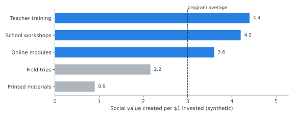
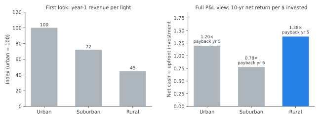

## Experience at a glance

**Researcher · KPMG Climate Change & Sustainability · Jul 2016 – Apr 2018**

- Conducted **Social Return on Investment (SROI)** analysis for three Taiwan-listed clients
- Environmental-education program: ran a cost-benefit analysis and made pricing and program recommendations that raised the program's **average SROI by about 10%**
- Smart-city streetlight project: forecasted the project's profit and loss and identified an opportunity to **expand installation into rural areas**
- Analyzed 200+ international climate policies across six energy sectors, and turned complex ESG performance data into executive-ready briefs for C-level stakeholders

---

## Method demo: from sustainability project to investment decision

[Illustrative demonstration using synthetic data. Client financial information and project assumptions are not shown.]{.illustrative}

### 1. What SROI measures

SROI asks a business question about a social or environmental program: **for every dollar invested, how much value does it create?** Answering it means tracing the chain from spending to outcomes, then putting a monetary value on those outcomes.

::: {.flow}
::: {.flow-step}
**Investment**
[program budget]{.small}
:::
::: {.flow-step}
**Activities**
[what the program does]{.small}
:::
::: {.flow-step}
**Outputs**
[people reached, sessions held]{.small}
:::
::: {.flow-step}
**Stakeholder outcomes**
[what changes for them]{.small}
:::
::: {.flow-step}
**Monetized benefits**
[financial proxies, adjusted for attribution]{.small}
:::
::: {.flow-step .accent}
**SROI → decision**
:::
:::

::: {.impact-grid}
::: {.impact-card}
[SROI = value created ÷ investment]{.num}
[An SROI of 3.0 means each $1 invested creates about $3 of social and economic value.]{.label}
:::
:::

### 2. Cost-benefit analysis: finding where value is created

A single program-level SROI hides a lot. Breaking the program into components shows which activities create the most value per dollar, and which ones drain the budget.

{fig-alt="Horizontal bars of social value per dollar by program component, with teacher training, school workshops and online modules above the program average and field trips and printed materials below it."}

[Illustrative demonstration using synthetic data. Client financial information and project assumptions are not shown.]{.illustrative}

::: {.flow}
::: {.flow-step}
**Current design**
[one blended SROI]{.small}
:::
::: {.flow-step}
**Component view**
[value per $ by activity]{.small}
:::
::: {.flow-step}
**Find high-cost / low-impact**
[e.g., printed materials above]{.small}
:::
::: {.flow-step}
**Reallocate or reprice**
[shift budget to high-value activities]{.small}
:::
::: {.flow-step .accent}
**More value per $**
:::
:::

In the real engagement, this kind of analysis led to **pricing and program-design recommendations that raised average SROI by about 10%**. The chart above is fictional and does not reproduce that client's figures.

### 3. Smart-city investment case: which areas are worth expanding into?

The second example is a P&L forecast for a fictional smart-streetlight rollout, comparing three deployment scenarios.

::: {.flow}
::: {.flow-step}
**Upfront investment**
:::
::: {.flow-step}
**Operating & maintenance cost**
:::
::: {.flow-step}
**Revenue & economic benefit**
:::
::: {.flow-step}
**Deployment scenario**
[urban / suburban / rural]{.small}
:::
::: {.flow-step}
**P&L forecast**
:::
::: {.flow-step .accent}
**Expansion decision**
:::
:::

{fig-alt="Two bar charts. Left: year-1 revenue per light indexed, urban 100, suburban 72, rural 45. Right: 10-year net return per dollar invested, urban 1.20x, suburban 0.78x, rural 1.38x."}

[Illustrative demonstration using synthetic data. Client financial information and project assumptions are not shown.]{.illustrative}

**The insight:** judged on a headline metric, the rural scenario looks least attractive. Once upfront cost, operating cost, and benefits are modeled over the asset's life, the ranking can change. A segment that is easy to dismiss can turn out to be an **economically viable expansion opportunity**. That was the kind of conclusion the real forecast supported.

---

**Why this matters to the rest of my work.** KPMG is where I started turning qualitative "should we do this?" questions into quantified investment cases. That habit carried through customer and pricing research at [Ipsos](../early-ipsos-pricing-research/index.qmd) and into product and pricing decisions at LINE.

[Both projects on this page are fictional and every value is synthetic. The demo shows methodology only and does not represent any KPMG client engagement.]{.disclosure}
