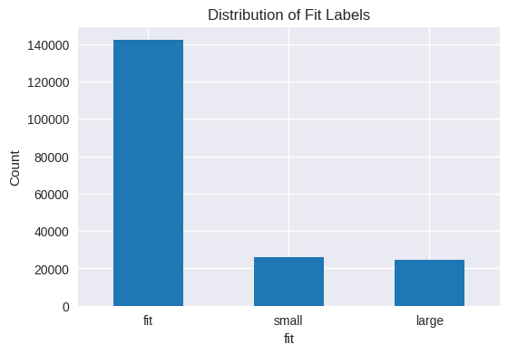
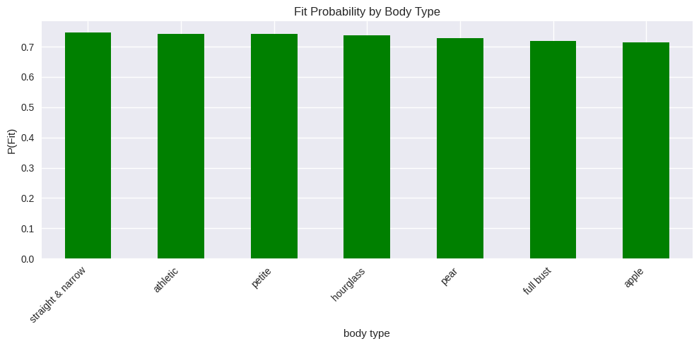
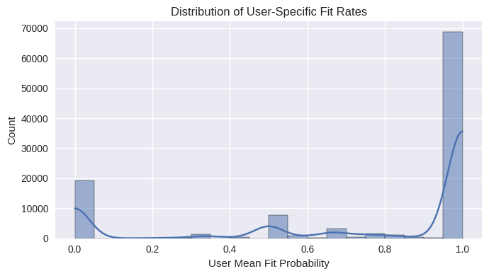

::: {.impact-grid}
::: {.impact-card}
[0.855]{.num}
[test AUC (hybrid model)]{.label}
:::
::: {.impact-card}
[0.979]{.num}
[Precision@1: the top-ranked item fits ~98% of the time]{.label}
:::
::: {.impact-card}
[192K]{.num}
[reviews from 105K users and 5.8K items]{.label}
:::
:::

## Business problem

For a fashion-rental platform, a garment that doesn't fit is expensive twice. It triggers a return, with shipping and cleaning costs, and it produces an unhappy customer who may not rent again. If the platform can predict **whether a specific item will fit a specific renter**, it can put the best-fitting items at the top of each customer's results and cut avoidable returns.

## Data

The data is the public Rent the Runway review dataset: 192,544 reviews from 105,571 users on 5,850 items. Each review records whether the item ran **small**, **large**, or **fit**. I collapsed small and large into *not fit*, which leaves a 74% / 26% class imbalance. I handled the imbalance with balanced class weights rather than resampling.

::: {.card-grid-2}
::: {}

:::
::: {}

:::
:::

## Approach

Three feature families feed one scikit-learn pipeline:

::: {.flow}
::: {.flow-step}
**Body & item numerics**
[height, weight, bust, size, age: parsed from raw strings, imputed, scaled]{.small}
:::
::: {.flow-step}
**Categoricals**
[user, item, category, occasion, body type: one-hot]{.small}
:::
::: {.flow-step}
**Review text**
[TF-IDF on 1–2-grams, 10K features]{.small}
:::
::: {.flow-step .accent}
**ColumnTransformer → Logistic regression**
[class-balanced]{.small}
:::
::: {.flow-step}
**Rank items per user**
[by predicted fit probability]{.small}
:::
:::

**Leakage control.** I split train/validation/test **by user** (70 / 10 / 20). Each renter's reviews appear in exactly one partition, so the test score reflects performance on customers the model has never seen.

## Results

**Ablation: what each feature source adds (test set)**

| Model | AUC | Balanced accuracy | Macro F1 |
|---|---:|---:|---:|
| Majority-class baseline | n/a | 0.500 | 0.424 |
| Numeric features only | 0.643 | 0.622 | 0.606 |
| Review text only | 0.830 | 0.753 | 0.735 |
| **Hybrid (all features)** | **0.855** | **0.775** | **0.765** |

**Recommendation view: Precision@K on test users**

| K | 1 | 3 | 5 | 10 |
|---|---:|---:|---:|---:|
| Mean P@K | **0.979** | 0.929 | 0.920 | 0.915 |

The hybrid model beats both single-source models, so body measurements and item metadata add signal that review text alone misses. The ranking metric matters most for the business. When the model recommends a single "top fit pick", that item fits almost 98% of the time, which maps directly onto a *recommended size* or *best fit for you* feature.

## What I'd do next

- Replace one-hot user/item IDs with latent factors to handle cold-start users.
- Estimate the **return-cost savings** by pricing the reduction in not-fit rentals among top-ranked items.
- Test a gradient-boosted model against the logistic baseline, keeping the user-level split.

## Tools

Python · pandas · scikit-learn (Pipeline, ColumnTransformer, TF-IDF, LogisticRegression) · matplotlib / seaborn

[UCSD MSBA · MGTA 461 Web Mining · Oct–Dec 2025]{.note-muted}
